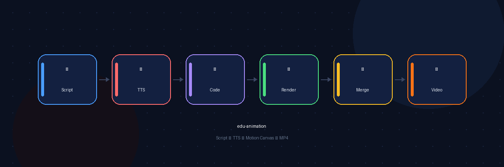

# edu-animation

> OpenClaw Skill · 从脚本到科普视频，一条龙自动化

**Script → TTS → Motion Canvas → MP4**



## 特性

- 🎙️ **Edge TTS** — 免费中文/英文语音合成
- 🎨 **Motion Canvas** — 代码驱动动画，可复用、可迭代
- ⚡ **一键渲染** — Puppeteer 驱动 Chrome 自动化输出 MP4
- 🇨🇳 **中文优先** — 配色、字体、TTS 均为中文优化

## 工作流

```
1. 写脚本 (Markdown)
2. gen-tts.sh   → 语音文件
3. init-project.sh → Motion Canvas 项目
4. 写场景代码
5. render.sh    → 最终 MP4
```

## 快速开始

```bash
# 生成语音
bash scripts/gen-tts.sh /tmp/my-video "这是第一段旁白"
bash scripts/gen-tts.sh /tmp/my-video "这是第二段旁白"

# 初始化项目
bash scripts/init-project.sh /tmp/my-video

# 写场景代码到 src/scenes/scene{N}.tsx 后渲染
bash scripts/render.sh /tmp/my-video --no-audio --output final.mp4
```

## 依赖

- Node.js 16+ / npm
- Python 3 + edge-tts
- Google Chrome
- FFmpeg


## 产出示例

使用此 skill 制作的 [OpenClaw 科普视频](https://github.com/parafallen-maker/edu-animation)（2 分 15 秒，8 场景，Motion Canvas + Edge TTS）。
